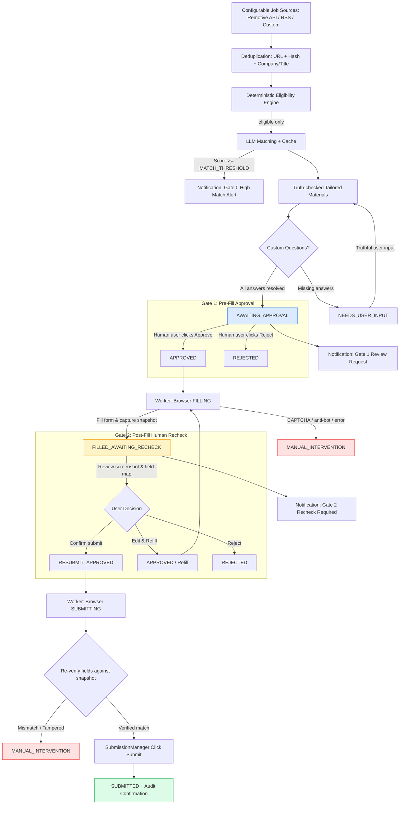

# Architecture

## Requirements and safety boundary

The system executes **Discover → Match → Prepare → Gate 1 (Pre-Fill Approval) → Fill → Gate 2 (Post-Fill Recheck) → Submit**. It never bypasses anti-bot controls, CAPTCHA, authentication, rate limits, or missing/unknown mandatory answers. `REQUIRE_APPROVAL=true` is mandatory. Candidate YAML and the master resume are the sole claim sources; generated content is rejected unless every claim is traceable to them.

## Two-Gate Safety Workflow

## System Components and Data Flow

1. **Job Ingestion & Sources**:
   Configurable sources via `JOB_SOURCES` (`remotive`, `rss`, `sample`) dynamically initialized by `sourceFactory.js`.
2. **Deduplication & Eligibility**:
   Four deduplication signals eliminate duplicate postings. Strict synchronous eligibility rules run before any LLM inference.
3. **LLM Matching & Tailoring**:
   Evaluates job description against candidate master profile and generates truth-bounded resumes and question answers. Dispatches **Gate 0 Notifications** whenever `matchScore >= MATCH_THRESHOLD`.
4. **Gate 1 Approval**:
   Application pauses at `AWAITING_APPROVAL`. Dispatches **Gate 1 Notifications**. User explicitly reviews resume and answers.
5. **Browser Auto-Fill & Pause**:
   The `browser-application` worker loads the live form in a dedicated Playwright instance, fills verified answers, captures full-page screenshot and structured `field -> value` map, and pauses in `FILLED_AWAITING_RECHECK`. Automation strictly does **not** proceed to submission.
6. **Gate 2 Recheck & Confirmation**:
   Dispatches **Gate 2 Notifications**. The React UI renders the captured screenshot and structured field map. The user can:
   - **Approve & Submit**: Transitions to `RESUBMIT_APPROVED`, enqueuing the final submission worker.
   - **Edit & Refill**: Allows modifying answers and triggering a re-fill.
   - **Reject**: Marks application as rejected.
7. **Re-Verification & Safe Submission**:
   When processing `RESUBMIT_APPROVED`, the worker re-evaluates all page fields against the reviewed snapshot. If any field differs, it halts in `MANUAL_INTERVENTION` rather than submitting blindly. Only if verified does `SubmissionManager` submit and record audit confirmation.
8. **Multi-Channel Notifications**:
   `NotificationDispatcher` routes notifications across configured `NOTIFICATION_CHANNELS` (`email` via SMTP and `webhook` supporting Slack, Discord, Telegram, or custom endpoints). Approval is never executed via notification—always via authenticated API.

## Database and Audit Design

PostgreSQL models `Job`, `Application`, `ApplicationAnswer`, `ApplicationEvent`, `UserApproval`, `ResumeVersion`, and `AutomationRun`. Every state transition executes inside a database transaction via `transitionApplication()`, producing an immutable `ApplicationEvent` audit record. User approvals at both Gate 1 and Gate 2 record actor and timestamp in `UserApproval`.

## Browser, Security, and Deployment

- Headless/headed Playwright runs with honest support advertising.
- Zero CAPTCHA or anti-bot bypass. If encountered, halts with `MANUAL_INTERVENTION`.
- Docker Compose orchestrates frontend, API, worker, PostgreSQL, and Redis.
- Secrets live strictly in `.env.local`.
