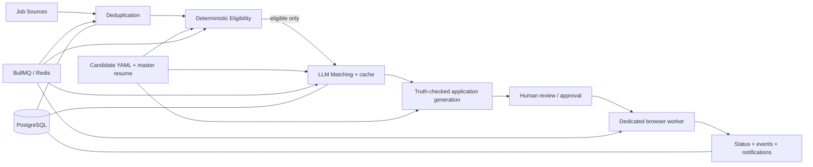

# Architecture

## Requirements and safety boundary

The system executes **Prepare → Review → Approve → Submit**. It never bypasses anti-bot controls, CAPTCHA, authentication, rate limits, or missing/unknown mandatory answers. `REQUIRE_APPROVAL=true` is mandatory. Candidate YAML and the master resume are the sole claim sources; generated content is rejected unless every claim is traceable to them.

## Components and data flow

Express handles validated API requests only. BullMQ workers perform discovery, matching, preparation, notifications, and browser work. PostgreSQL is the durable audit store; Redis carries queued work. The React UI calls Express through a small fetch client.

## Database and AI design

Prisma models jobs, requirements, matches, resumes, applications, answers, approval decisions, automation runs, sources, and immutable events. Deduplication combines source ID, canonical URL, company/title/location, and normalized-description SHA-256.

Hard eligibility is a synchronous pure function and runs before any model request. The provider factory chooses OpenAI or Anthropic. Responses use structured JSON, Zod validation, two bounded repair retries, prompt version metadata, cache keys, usage/cost records, and no model-only eligibility decisions.

## Browser, security, and deployment

Adapters honestly advertise support. Browser workers stop and persist manual-intervention state for CAPTCHA, authentication, unexpected forms, blocked sites, or unknown answers. Docker Compose runs frontend, API, worker, Postgres, and Redis with health checks. Secrets live only in ignored environment files; logging redacts authorization and sensitive profile fields.
